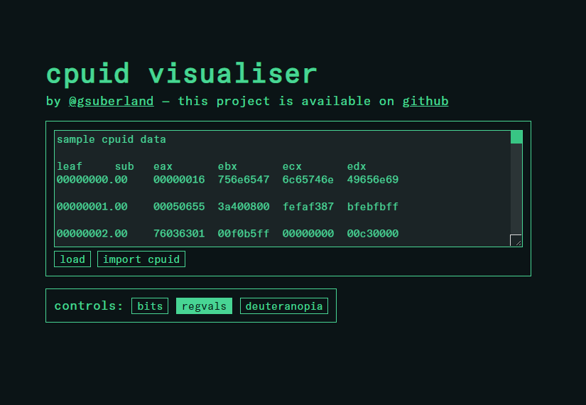

# web-cpuid

web-cpuid is a lightweight web based decoder and visualiser for CPUID information.



you can find a hosted version of it [here](https://cpuid.apps.poly.nomial.co.uk/).

## features

current features include:

- shows both raw and decoded values for fields
- optionally shows the bit range of each field inline
- optionally shows the value of each register inline
- fields glow when the mouse hovers over them
- alt-text for each cpuid leaf number shows a conversion to decimal
- deuteranopia mode for improved visibility with red-green colourblindness
- load cpuid files from [cpuid explorer](http://www.flounder.com/cpuid_explorer1.htm)

## usage

either use the [hosted version](https://cpuid.apps.poly.nomial.co.uk/) or open `src/cpuid.html` in a browser locally.

### data format

cpuid values are loaded into the textarea at the top, in one of two formats.

#### standard format

the standard format is the following, with all values given as hexadecimal:

```
[leaf].[subleaf] [eax] [ebx] [ecx] [edx]
```

for example:

```
00000000.00    00000016  756e6547  6c65746e  49656e69
00000001.00    00050655  3a400800  fefaf387  bfebfbff
00000002.00    76036301  00f0b5ff  00000000  00c30000
00000003.00    00000000  00000000  01234567  abcdef00
00000004.00    7c004121  01c0003f  0000003f  00000000
```

any number of spaces can be present between fields.

#### linux cpuid raw format

alternatively, the raw output format from the linux [cpuid](https://linux.die.net/man/1/cpuid) tool can be used. the recommended invocation is `cpuid -ir1`.

```
leaf subleaf: eax=[eax] ebx=[ebx] ecx=[ecx] edx=[edx]
```

for example:

```
   0x00000000 0x00: eax=0x00000015 ebx=0x756e6547 ecx=0x6c65746e edx=0x49656e69
   0x00000001 0x00: eax=0x00050655 ebx=0x15400800 ecx=0xfeda3203 edx=0x1f8bfbff
   0x00000002 0x00: eax=0x76036301 ebx=0x00f0b5ff ecx=0x00000000 edx=0x00c30000
   0x00000003 0x00: eax=0x00000000 ebx=0x00000000 ecx=0x00000000 edx=0x00000000
```

### getting cpuid values

on linux the easiest way is to run `cpuid -ir1` using the [cpuid](https://linux.die.net/man/1/cpuid) package.

Windows users can use the included `cpuid_dump.linq` [linqpad](https://www.linqpad.net/) script to dump these values in the right format. paste them into the text box and press the load button. you can also click the "import cpuid" button to import a cpuid dump file from [cpuid explorer](http://www.flounder.com/cpuid_explorer1.htm). this is currently the only supported automatic importer.

### controls

the on-page controls are as follows:

- bits - toggles showing the bit ranges for each field
- regvals - toggles showing the value of each register in its heading
- deuteranopia - toggles an accessible colour scheme for red-green colour-blind people

## build

**building is not required for general use.** the files in `src/` are suitable for immediate use as long as you're not hosting them on a server that needs subresource integrity (SRI) - just open `src/cpuid.html` in a browser and you're good to go.

the `build.py` script generates SHA256 SRI tags for the referenced scripts and styles and outputs everything into a `build` subdirectory. it also adds a crossorigin tag to the font preload. look for attributes beginning with `data-build-` in `cpuid.html` for places where this build script acts.

## status

web-cpuid is in active development and is not yet complete. currently only Intel leaves are supported, but the framework is in place to be able to support AMD, VIA, etc.

current task list:

- [ ] decode all intel cpuid fields in the basic 0x00000000 to 0x0fffffff range
- [ ] decode all intel cpuid fields in the extended 0x80000000 to 0x8fffffff range
- [ ] add support for auto-detection of vendor
- [ ] decode all AMD cpuid fileds in the basic 0x00000000 to 0x0fffffff range
- [ ] decode all AMD cpuid fields in the extended 0x80000000 to 0x8fffffff range
- [ ] add sub-leaf support
- [ ] add support for contextually decoding hypervisor leaves in the 0x40000000 to 0x4fffffff range

## development

the application is split into the following files:

- `cpuid.html` - the html page that everything is loaded into
- `cpuid.css` - the style for the page
- `cpuid.js` - the core javascript that renders the diagrams
- `cpuid_interact.js` - user interaction code, also loads values and builds headings
- `cpuid_intel.js` - CPUID leaf definitions for Intel processors
- `fontfix.js` - a helper script that resizes the font to account for variances in monospace font sizes
- `cpuid_startup.js` - initial boostrap code that runs when the page is loaded

### architecture

each diagram is rendered by a `CpuidDiagram` object. it maintains a 2D array of cells, like a text-based image. each cell is tagged with a style and a reference to the field that owns it. the cells are defined using `CpuidDiagramCell` objects. the cells are then converted to span elements when rendering them out.

fields are defined by `CpuidField` objects. a field has a name, a bits field (either a single integer, or an array where element 0 is the high bit and element 1 is the low bit), a resolver, and various options. a resolver is a function that turns raw values into decoded values. resolvers for standard types like bool, increment, ascii, etc. are available as static methods of the `CpuidBaseResolvers` class. custom resolvers are implemented in a resolver class for the CPU vendor, e.g. `CpuidResolversIntel` for Intel. if the resolver for a field is null, only the raw value is shown.

field options include `reserved`, which marks the field as reserved, and `printRawHex`, which causes the field's raw value to be written in hex. reserved fields consisting of more than one bit always have their values shown in hex, so `printRawHex` is not needed for those.

the fields for each register are defined inside a vendor-specific class, deriving from `CpuidFieldsBase`. the Intel fields are defined in `CpuidFieldsIntel`. each register definition contains an array of `CpuidField` objects. each register must have a complete set of fields encompassing all bits from 31 to 0, and they must be in descending bit order. fields must not overlap. the class has a function `getLeaf` which returns the definition for a leaf.

by convention, register field arrays are defined as a private class property named `cpuid_[leaf]_[reg]_fields` or `cpuid_[leaf]_[subleaf]_[reg]_fields` where the `leaf` and `subleaf` values are hexadecimal numbers, and `reg` is the register name (e.g. eax). each is preceded by a comment in the standard naming form `cpuid.leaf.subleaf.reg`. the register definitions are then grouped together inside a larger structure that provides description text for each leaf. registers or leaves that are reserved are marked with a comment rather than being completely omitted, to distinguish between purposeful exclusion and accidental oversight.

### inline events

this project has a policy of disallowing inline javascript within the html, so that it can comply with a content security policy that forbids inline scripts. as such, one cannot simply make a button with an inline event handler like `<button onclick="foo()">`. instead, these event handlers are assigned in `cpuid_startup.js`.

## code of conduct

please note that this project is released with a contributor code of conduct. by participating in this project, you agree to abide by its terms. the code of conduct can be found [here](CODE_OF_CONDUCT.md).

## license

web-cpuid is released under [MIT license](LICENSE).

the font used on the hosted version is [GT America Mono](https://www.grillitype.com/typeface/gt-america), a commercial font. I paid for a license to use it on my website. the font is not included in this repository as I do not have the rights to distribute it.