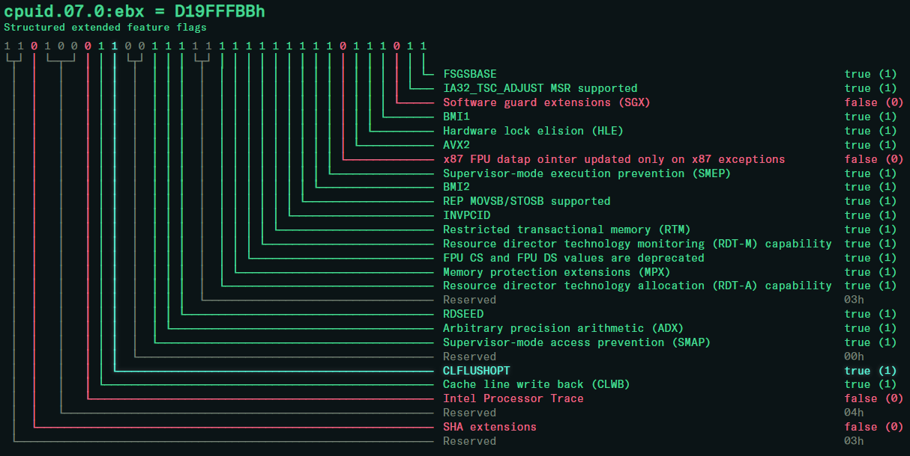

# web-cpuid

web-cpuid is a lightweight web based decoder for CPUID information.



you can find a hosted version of it [here](https://cpuid.apps.poly.nomial.co.uk/).

## features

current features include:

- shows both raw and decoded values for fields
- optionally shows the bit range of each field inline
- optionally shows the value of each register inline
- fields glow when the mouse hovers over them
- alt-text for each cpuid leaf number shows a conversion to decimal
- deuteranopia mode for improved visibility with red-green colourblindness

## usage

either use the hosted version or open `src/cpuid.html` in a browser locally.

cpuid values are loaded into the textarea at the top, in the following format:

```
leaf.subleaf eax ebx ecx edx
```

all values are to be given in hexadecimal. if you're on Windows you can use the included `cpuid_dump.linq` [linqpad](https://www.linqpad.net/) script to dump these values in the right format.

you can toggle the display of leaf register values and field bit ranges with the buttons at the top of the page.

## build

the files in `src/` are suitable for immediate use as long as you're not hosting them on a server that needs subresource integrity (SRI) - just open `cpuid.html` in a browser and you're good to go.

the `build.py` script generates SHA256 SRI tags for the referenced scripts and styles and outputs everything into a `build` subdirectory.

## status

web-cpuid is in active development and is not yet complete. currently only Intel leaves are supported, but the framework is in place to be able to support AMD, VIA, etc.

current task list:

- [ ] decode all intel cpuid fields in the basic 0x00000000 to 0x0fffffff range
- [ ] decode all intel cpuid fields in the extended 0x80000000 to 0x8fffffff range
- [ ] add support for auto-detection of vendor
- [ ] decode all AMD cpuid fileds in the basic 0x00000000 to 0x0fffffff range
- [ ] decode all AMD cpuid fields in the extended 0x80000000 to 0x8fffffff range
- [ ] add sub-leaf support
- [ ] add support for contextually decoding hypervisor leaves in the 0x40000000 to 0x4fffffff range

## development

the application is split into the following files:

- `cpuid.html` - the html page that everything is loaded into
- `cpuid.css` - the style for the page
- `cpuid.js` - the core javascript that renders the diagrams
- `cpuid_interact.js` - the code that interacts with the page to build the diagrams and respond to clicks
- `cpuid_intel.js` - the CPUID leaf definitions for Intel processors
- `fontfix.js` - a helper script that resizes the font to account for variances in monospace font sizes
- `cpuid_startup.js` - initial boostrap code that runs when the page is loaded

## license

web-cpuid is released under MIT license.

the font used on the hosted version is [GT America Mono](https://www.grillitype.com/typeface/gt-america), a commercial font. I paid for a license to use it on my website. the font is not included in this repository as I do not have the rights to distribute it.